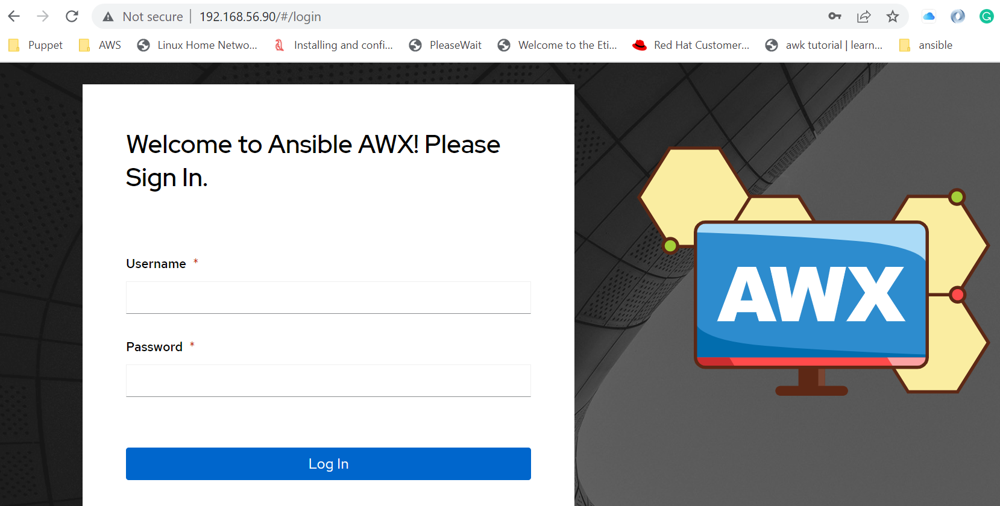
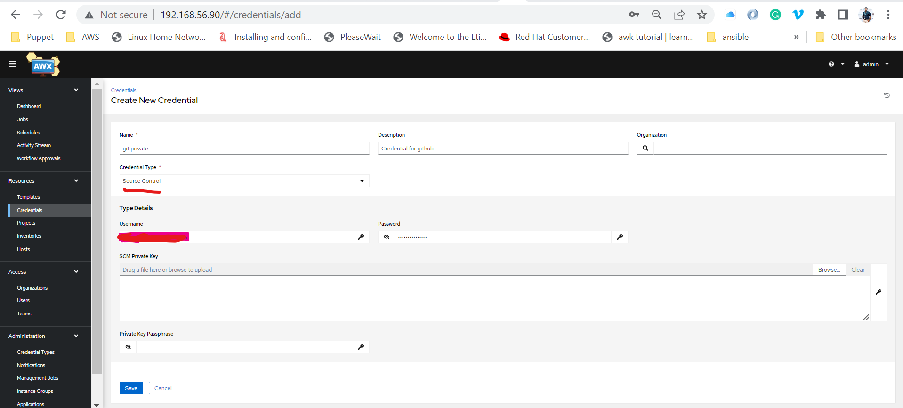
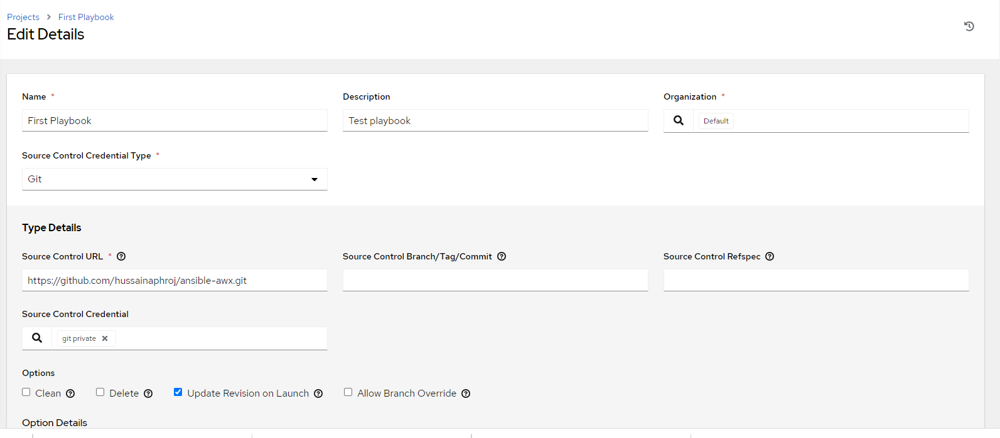
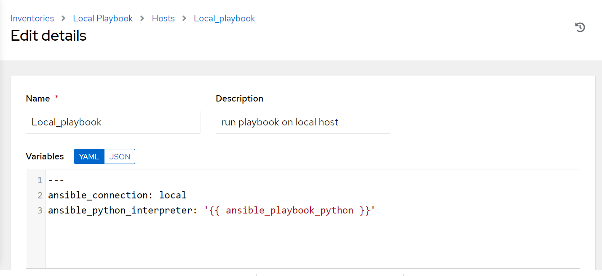
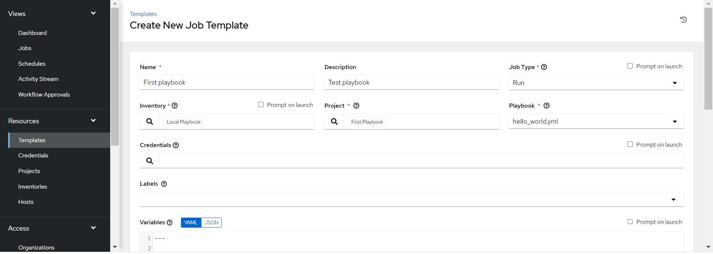
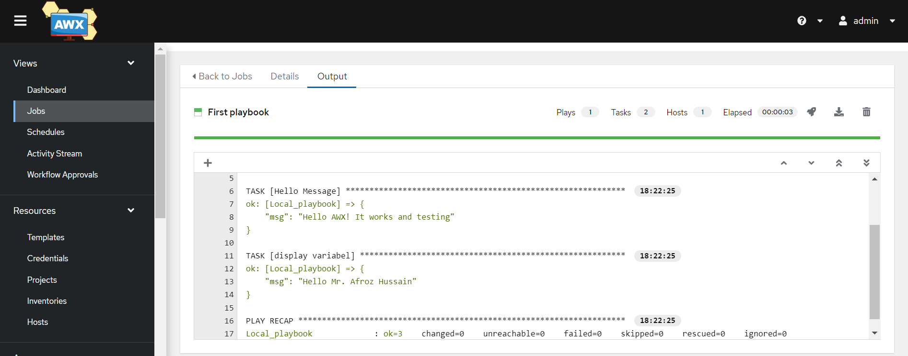
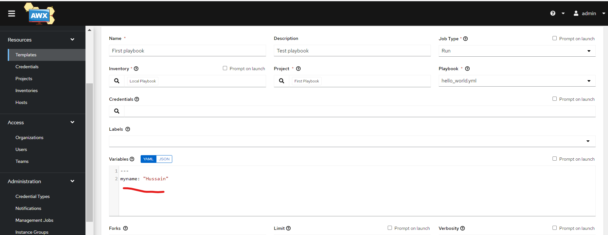
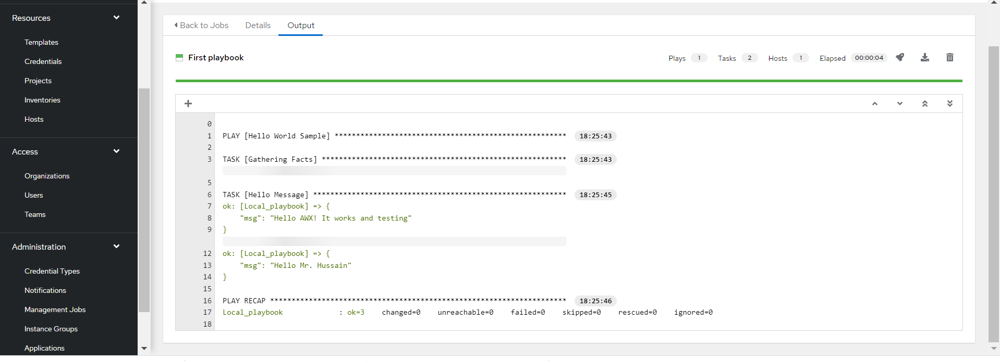

# ansible-awx
Ansible is a great tool to automate IT infrastructure, application deployment, configuring the application, and managing & coordinating multiple servers from a single Ansible server. 

Ansible is widely used as a command line tool but `Ansible Tower` and `AWX` are front-end web application that provides a user interface to manage Ansible playbooks and inventories.  
`Ansible Tower` is an enterprise edition and whereas `AWX` is open source with a similar feature as `Ansible Tower`.


Today, we will be setting up the `AWX` and running a sample playbook. Excited? Let begin

### AWX Installation
I have used the vagrant ubuntu 18.04 VM to set up AWX in this tutorial.
### Installation 
* Update the repository and upgrade all the packages  
   `apt-get update && apt-get upgrade`
* Please make sure that `python 3.6` and greater should be installed.  
* Install Software properties  
`apt install software-properties-common`
* Install Docker
```
curl -fsSL https://download.docker.com/linux/ubuntu/gpg | apt-key add -
add-apt-repository "deb [arch=amd64] https://download.docker.com/linux/ubuntu $(lsb_release -cs) stable"
apt install -y docker-ce docker-ce-cli containerd.io
```
* Install docker-compose
```
wget https://github.com/docker/compose/releases/download/v2.11.2/docker-compose-linux-x86_64
chmod +x docker-compose-linux-x86_64
mv docker-compose-linux-x86_64 /usr/local/bin/docker-compose
docker-compose --version
```
* Install `Ansible`  
```
apt-add-repository ppa:ansible/ansible
apt-get update
apt install ansible -y
ansible --version
```
* Install pip and docer-compose
```
apt install -y python3-pip git pwgen
pip3 install setuptools-rust
pip3 install --upgrade pip
pip3 install docker-compose==1.28.5
```
* Finally, install `AWX`  
```
wget https://github.com/ansible/awx/archive/17.1.0.zip
apt install unzip
unzip 17.1.0.zip
cd awx-17.1.0/installer/
change admin credential in inventoy file
vi inventory
    admin_user=admin
    admin_password=Test1234

ansible-playbook -i inventory install.yml
```
* verify the installation by running `docker ps`, the following containers should be running  
```
CONTAINER ID   IMAGE                COMMAND                  CREATED       STATUS       PORTS                                   NAMES
c9ab2b9ae9ee   ansible/awx:17.1.0   "/usr/bin/tini -- /u…"   3 weeks ago   Up 3 weeks   8052/tcp                                awx_task
423bd411b5c5   ansible/awx:17.1.0   "/usr/bin/tini -- /b…"   3 weeks ago   Up 3 weeks   0.0.0.0:80->8052/tcp, :::80->8052/tcp   awx_web
42008d8517b3   postgres:12          "docker-entrypoint.s…"   3 weeks ago   Up 3 weeks   5432/tcp                                awx_postgres
dcce5a0a8984   redis                "docker-entrypoint.s…"   3 weeks ago   Up 3 weeks   6379/tcp                                awx_redis
```  
Now, you can access the AWX dashboard from the browser using `http://<ipaddress>` and can log in by providing credentials that have been set in the `inventory` file during the installation stage  


### AWX Set up to run playbook
In this tutorial, we will connect to `GitHub` to retrieve ansible playbooks and other files. We need to set up the credential first to retrieve the files from our GitHub.  

* set up github credentials  
In AWX, Go to Credentials under Resources and click on Add button to add a new credential entry as shown in the screenshots below. Please note that username and password are your GitHub credentials


* Create project in AWX
To run any playbook, we need to create a project first and the project belongs to an organization. It can be created by Resource->project as shown below:  


* Create an inventory
An inventory contains the target hosts/node details which can be managed from ansible. It can be created by Resource -> Inventories as shown below:  
  

    Once the inventory gets created, then we need to attach the host's details in the same inventory as shown below:
    

* Create a template
Finally, we need to create a template, which runs our playbook. We need to provide the organization, project, inventory, and playbook details that we have created previously. It can be created by Resources -> Templates as shown below:
 

The templates(playbook) can be run multiple time by providing the different variables as shown below:
   

 
 


